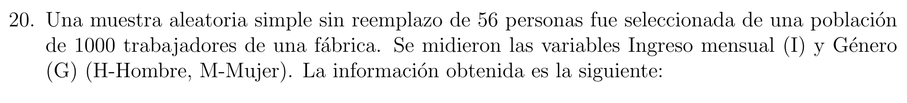
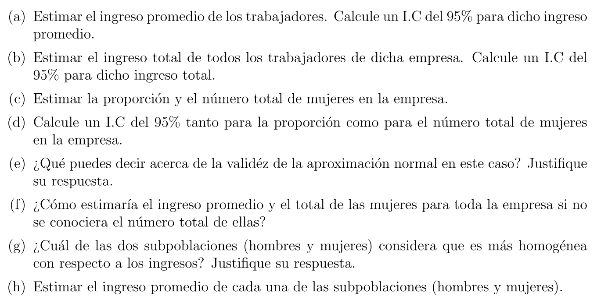
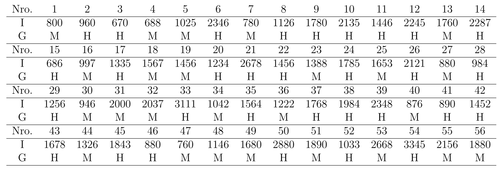

```{r setup, include=FALSE}
knitr::opts_chunk$set(echo = TRUE)
```

# Caso de estudio n°3:

Habiendo hecho esto, procederemos con el intervalo de confianza (IC)

Contexto: Suponga que se desea realizar un estudio de muestreo en un municipio $A$ del departamento de Antioquia para estimar la **proporción de votantes** registrados con intención de voto por un candidato $X$. Para ello:

-   Se dispone del listado de todos los habitantes mayores de edad que conforman el municipio, $N = 10000$ Habitantes.

-   Se opta por seleccionar una MAS sin remplazo de dicha población, $n = 500$.

-   Se encuentra que en dicha muestra sólo $350$ personas estaban inscritas para votar y de éstas $150$ estaban a favor del candidato $X$.

¿Cómo estimar la proporción de votantes registrados con intención de voto por el candidato $X$?

## Solución

extraemos los datos del enunciado anterior

$N$: 10.000 habitantes *(de la población total)*

$n$: 500 hab. tamaño de la muestra

$N_k$: Desconocido

$a_k$: 150 *(voto a favor del candidato X)*

$n_k$: 350

```{r}
ak <- 150
nk <- 350
N <- 10000
n <- 500
```

$\widehat{p}_k = \frac{a_k}{n_k} = \frac{150}{350} = 0.4285714 \approx 0.43$

```{r}
# "p" gorro:
pg <- round(ak/nk,2)
```

## I.C.

Habiendo hecho esto, procederemos con el intervalo de confianza (IC)

Como $N_k$ es desconocido utilizare:

$\widehat{Var}[\widehat{p}_k] = \frac{N-n}{N}*\frac{\widehat{p}_k(1-\widehat{p}_k)}{n_k-1}$ *(1)*

```{r}
# Varianza estimada:
var_p <- (N-n)/N * pg*(1-pg)/(nk-1)
print("# Varianza estimada:")
print(var_p)
```

un intervalo al $95\%$ esta dado por:

$\widehat{p}_k \pm t_{1-\alpha/2 \ , \ n_k-1} \ \sqrt{\widehat{V}(\widehat{p}_k)}$

```{r echo=FALSE}
# IC al 95%:
LI <- pg - qt(0.025,nk-1, lower.tail = F)*sqrt(var_p)
LU <- pg + qt(0.025,nk-1, lower.tail = F)*sqrt(var_p)

print("# IC para P_k")
print("#       Limite Inf ,   Limite Sup")
paste("(", LI, ",", LU, ")")
```

**Con esto vemos un IC al** $95\%$ de la proporción de votantes que tienen intención de voto por el candidato X.

# Caso de estudio n°4:

Contexto: Una multinacional de abrir nuevos puestos de trabajo en un barrio de Medellín.

para ello necesitas estimar de las personas que **NO trabajan**, el tiempo en (meses) que el jefe de hogar ha completado sin trabajar.

La empresa cuenta con lista de todos los hogares del barrio bajo estudio, conformado por 1000 hogares. se decide:

-   seleccionar una muestra piloto 10 hogares y se entrevista al jefe de hogar

los datos que se obtuvieron fueron los siguientes:

\newpage

| Hogar                    | 1   | 2   | 3   | 4   | 5   | 6   | 7   | 8   | 9   | 10  |
|--------------------------|-----|-----|-----|-----|-----|-----|-----|-----|-----|-----|
| Trabaja (1: SI \| 0: NO) | 1   | 0   | 1   | 0   | 0   | 1   | 0   | 1   | 0   | 0   |
| Tiempo (en meses)        |     | 3   |     | 12  | 5   |     | 7   |     | 8   | 2   |

¿Como estimar la **proporción** de hogares donde el jefe de hogar $NO$ trabaja?

¿Como estimar el **tiempo promedio** en meses, de los jefes de hogar que $NO$ han tenido trabajo?

## Solución:

### Primera pregunta:

Extraemos los datos del enunciado:

```{r}
#Valores necesitados:
nk <- 6
N <- 1000
n <- 10

# proporción estimada
pg <- nk/n
pg

#Tiempo en meses sin trabajar
tm <- c(3,12,5,7,8,2)
```

Para hallar IC, primero hallaremos el $\widehat{V}(\widehat{p})$

*Nota: es la misma fórmula anterior (1)*

```{r}
# Varianza estimada:
var_p <- (N-n)/N * pg*(1-pg)/(n-1)
print("# Varianza estimada:")
print(var_p)
```

#### IC

Por notación calcularemos el $\beta$ (error de estimación) *(esto con el fin de que no sea tan repetitivo todo)*

$
\beta = t_{\alpha/2 \ , \ n-1}\sqrt{\frac{\widehat{p}(1-\widehat{p})}{n-1} \frac{N-n}{N}}$

```{r}
# error de estimación:
b <- qt(0.025,n, lower.tail = F)*sqrt(var_p)
b
```

```{r}
#Calculando el IC
print("#       Limite Inf ,   Limite Sup")
paste("(", pg-b, ",", pg+b, ")")
```

Según el IC decimos con un nivel de confianza del $95\%$ en el barrio muestreado de Medellín los jefes de hogar que no trabajan están dentro del $24\%$ y el $96\%$; esto es preocupante ya que deja mucho que desear acerca de esta población, haciéndonos preguntar... ¿Cómo generan ingresos para el hogar?

### Segunda pregunta

Estimar la media:

$\widehat{\mu} = \bar{y}_k = \frac{1}{n}\sum y_{ki}$

```{r}
#Media estimada
yk <- mean(tm)
yk
```

Ahora estimamos la varianza de los datos de interés:

$S^2_k = \frac{1}{n-1}\sum (y_{ki}-\bar{y})^2$

```{r}
# Varianza estimada
sk <- var(tm)
sk
```

Por último, calculo de la varianza de la media estimada:

$\widehat{Var}(\bar{y}) = \frac{N-n}{N}\frac{S^2_k}{n_k}$

*Se utilizo una función creada para futuros trabajos tenerla presente y solamente llamarla cuando sea necesario:*

```{r}
#Funcion de varianza estimada de la media:
varmu <- function(N,n,sk,nk){
  "Ya que no se conoce Nk..."
  (N-n)/N * (sk)/nk
}
```

```{r echo=FALSE}
print("# Calculando la varianza estimada de la media con N_k desconocida: ")
varyk <- varmu(N,n,sk,nk)
varyk
```

#### IC

Un IC al $95\%$ para $\bar{y}$ (promedio de meses sin trabajar) están dados por:

$\bar{y} \ \pm \ t_{1-\alpha/2 \, \ nk-1}\sqrt{\widehat{V}(\bar{y})}$

```{r}
LI <- yk - qt(0.025,nk-1,lower.tail = F)*sqrt(varyk)


LU <- yk + qt(0.025,nk-1,lower.tail = F)*sqrt(varyk)

print("# IC para y_k")
print("#       Limite Inf ,   Limite Sup")
paste("(", LI, ",", LU, ")")
```

Podemos afirmar con un $\alpha = 0.05$ que los tiempos promedios en los cuales no han tenido ningún tipo de trabajo los responsables del hogar entre 3 a 10 meses; unido con lo anterior me deja pensando como hacen para subsistir estas familias... ¿Dependerán completamente del ingreso solidario del gobierno?

# Ejercicio n°20

Observemos el ejercicio:






Lo primero que haremos, será que ingresaremos la base de datos escrita en Excel.

```{r}
library(readxl)
df20 <- read_excel("data_sets20.xlsx")
```



## Literal (a):

Para estimar el promedio de los ingresos de los trabajadores utilizaremos:

un estimador puntual para $\mu$

$\widehat{\mu} = \bar{y} = \frac{1}{n} \sum{y_i}$

```{r}
# La función mean() hace lo descrito anteriormente:
## Podemos suponer que el ingreso esta escalonado en dolares

mug <- mean(df20$ingreso)
mug
```
Podemos ver que el promedio del ingreso de los trabajadores muestreados es $1570.161 dólares, esto en la actualidad es un salario alto, pero no podemos decir quienes fueron los encuestados, es decir, si le preguntaron a los trabajadores y gerentes, socios (personas que naturalmente ostentan un salario mucho más alto que un trabajador regular de fabrica)


Para calcular el IC al $95\%$ utilizaremos:

- La varianza muestral
- el límite en el error de la estimación
- un estadístico $Z_{\alpha/2}$, ya que $n > 30$

```{r}
# varianza muestral:
s2 <- var(df20$ingreso)
s2

#tamaño de la muestra:
n <- length(df20$ingreso)
n

#Tamaño de la población
N <- 1000

# Error
## Utilizamos una normal ya que el n > 30
B <- qnorm(0.025,lower.tail = F)*sqrt((s2*(N-n))/(N*n))
B
```


Un IC para el ingreso promedio es:
$\bar{y} \pm B$

```{r}
LI <- mug-B
LU <- mug+B
print("#       Limite Inf ,   Limite Sup")
paste("(", LI, ",", LU, ")")
```
Podemos ver que nuestro ingreso promedio se encuentra dentro de los $\$1401$ y los $\$1740$ dólares
es decir, estos trabajadores tienen muy buenos sueldos si su moneda de pago es el dólar.


## Literal (b):

Para hallar el total poblacional estimado, solamente tenemos que multiplicar nuestro estimador insesgado para $\mu$ con nuestro $N$ (población donde se extrajo la muestra)

$\widehat{\tau} = \widehat{\mu}*N$

```{r}
# total poblacional tau:
taug <- mug*N
taug
```


Para hallar el IC para el total del ingreso de los trabajadores de la fábrica basta con multiplicar los extremos del intervalo de confianza anterior por $N = 1000$

```{r}
print("#       Limite Inf ,   Limite Sup")
paste("(", LI*N, ",", LU*N, ")")
```
Concluimos que el total de ingreso de los trabajadores esta entre los 1401131 y los 1739189 dólares

## Literal (c):

1. Para estimar la proporción de las mujeres en la empresa primero tenemos que hacer un conteo de cuantas mujeres hay en la muestra

```{r include=FALSE}
library(magrittr)
library(tidyverse)
```


```{r}
# Convertiremos en factor la columna genero
df20$genero %<>% as.factor()

# Conteo de las mujeres de la muestra:
## El dato que nos interesa es el primero ya que el otro representa número de columnas
df20 %>% filter(genero == "M") %>% dim(.)

fem <- 25
```
Ahora procederemos a calcular $\widehat{p} = \frac{1}{n} \sum{y_i}$

```{r}
# Proporción estimada:
pg <- fem/n
pg
```

la proporción estimada de mujeres en la fábrica representa aproximadamente $44.64\% \approx 45\%$

2. para el caso del total de mujeres en la empresa, solo basta con tomar el resultado anterior y multiplicarlo por el $N = 1000$

```{r}
# Total poblacional:
N*pg
```
el total estimado de mujeres en la población de la fábrica es $446.42 \approx 447$

## Literal (d):

Un IC para la proporción sería:

```{r}
# Hallar el límite en el error de estimación
B <- qnorm(0.025,lower.tail = F)*sqrt(((pg*(1-pg))*(N-n))/((n-1)*N))
B

LI <- pg-B
LU <- pg+B

print("# IC para p")
print("#       Limite Inf ,   Limite Sup")
paste("(", LI, ",", LU, ")")
```
podemos notar que la proporción de mujeres abarca desde los 32% hasta más de la mitad con un 58% esto nos da un indicio que hay una cantidad significativa de mujeres.

Para el caso del total de las mujeres, hacemos como en los casos anteriores, simplemente multiplicamos nuestro IC por nuestro $N$

```{r}
print("# IC para tau")
print("#       Limite Inf ,   Limite Sup")
paste("(", LI*N, ",", LU*N, ")")
```

Este caso no se diferencia en el anterior al ver una cantidad significativa en este intervalo, superando la mitad del valor de $N$


## Literal (e):

La aproximación es buena, es decir, gracias a que tenemos un $n>30$ podremos decir que nos aproximamos a una tendencia normal, esto se debe al **TCL** que nos garantiza normalidad cuando las muestras respectivas son lo suficientemente grandes (significativas) como para por medio de modificaciones aproxime a una distribución normal.


## Literal (f):
Para el ingreso promedio de las mujeres tendríamos que considerar una subpoblación, que en este caso sería de las mujeres.
Se suman todos los valores de los ingresos de esa población y se divide entre la cantidad de elementos de la subpoblación.
Para el total dado que no conocemos el valor de la subpoblación para determinar el factor de corrección se trabaja con la población y la muestra (N/n) multiplicado por el promedio así tendríamos un estimador para el total

## Literal (g) y (h):

Para responder a esta pregunta tendremos que observar cuál de los datos contiene mayor varianza respecto a la media estimada $\widehat{V}(\widehat{\mu})$, pero primero observemos un gráfico de boxplot para analizar a priori este enunciado:

```{r}
boxplot(ingreso ~ genero, data = df20, col =c("red", "blue"))
legend("topright", inset = .02,legend=c("Hombres", "Mujeres"),
       col=c("red", "blue"), fill=c("red", "blue"), cex=0.8)
```

Podemos notar por medio de la gráfica que los hombres tienen ingresos más altos y variables, por otro lado, las mujeres tienen ingresos más centrados y con menos variabilidad

```{r}
# Estimar el ingreso promedio de las subpoblaciones:

# Filtrar las bases de datos por hombre y mujer
dfH <- df20 %>% filter(genero == "H")
dfH
dfM <- df20 %>% filter(genero == "M")
dfM

# mirar promedios por genero:

## Promedio del ingreso Mujer:
mean(dfM$ingreso)

## Promedio del ingreso Hombre:
mean(dfH$ingreso)
```

los hombres tienen un promedio más alto en cuestión de ingresos, pero lo que nos importan es cual es menos variable, para determinar cuál es más homogéneo

para esto utilizaremos:
$\widehat{V}(\bar{y}) = \frac{S^2}{n} * (\frac{N-n}{n}) $

```{r}
# Datos a utilizar:
skH <- var(dfH$ingreso)
nkH <- length(dfH$ingreso)
skM <- var(dfM$ingreso)
nkM <- length(dfM$ingreso)


# Varianza de la media muestral:

## Hombres
varmuH <- varmu(N,n,skH,nkH)
varmuH

## Mujeres:
varmuM <- varmu(N,n,skM,nkM)
varmuM
```

Como lo vimos en el Boxplot, los datos de los hombres presentan una variabilidad mucho más alta que el de las mujeres, por ende, nuestra población más homogénea es la de las mujeres.

```{r eval=FALSE, include=FALSE}
knitr::purl("Tarea2_Muestreo.Rmd", "Tarea2_Muestreo.R")
```

